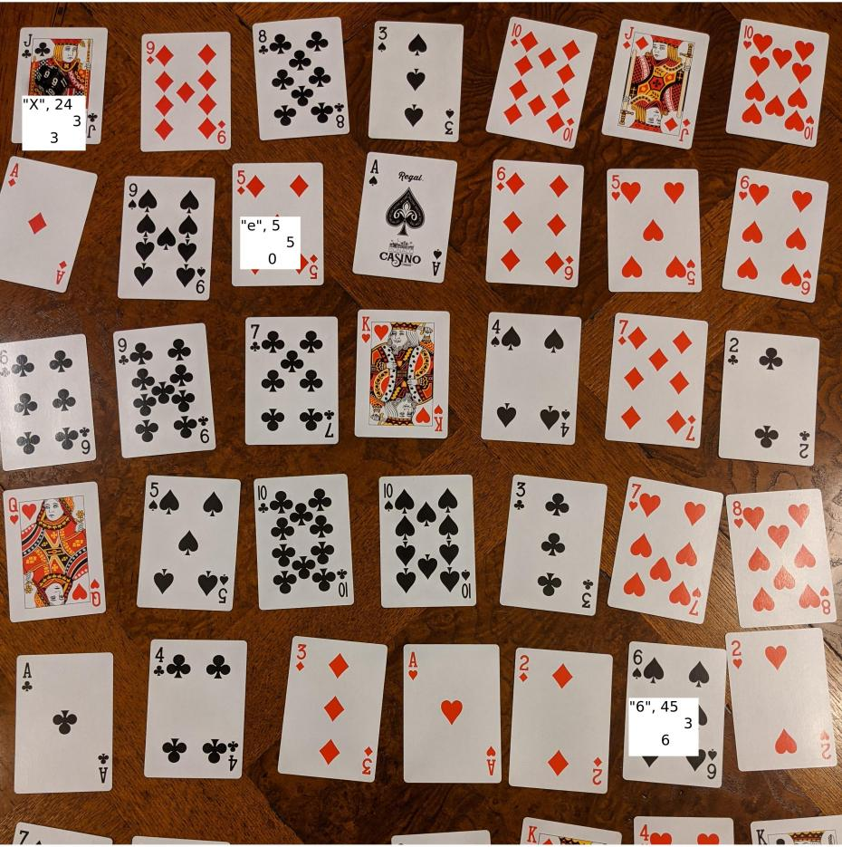

# LC4-67 cipher
LC4-67 ) is a low-tech a symmetric cipher  that can be computed by hand; but unlike many historical ciphers, LC4 is designed to resist potent computer attacks. It's designed for manual encryption and decryption. 

LC4-67  is inspired by the ElsieFour (LC4) cipher introduced by Alan Kaminsky. This cipher might be useful to you if you don't have access to a computer or you don't trust it, but need top-tier privacy protection.

The main advantage of this version lies in its wisely chosen programming language - Javascript. One of the significant benefits of Javascript is its ubiquity; it runs on almost any device equipped with an internet browser. There's no need for installations, and the script operates offline. lc4-67.html

The LC4-67 version introduces several improvements; you can change the number of characters, 7x7 = 49. This makes it possible to encrypt various structured information, or to make manual decryption easier - fewer cards  6x6 = 36.


There's also a 3D-printable SCAD model of the whole thing.


### Character board

We have added some real punctuation, basic stuff for writing expressions,
punctuation and quotes. The letters of the board now look like this:

```
_ a b c d e f
g h i j k l m
n o p q r s t
u v w x y z .
0 1 2 3 4 5 6
7 8 9 , - + *
/ : ? ! ' ( )
```

Zoomed in, it's very practical to have extra position information written on
the tiles:

```
/-----\  /-----\  /-----\  /-----\  /-----\
|     |  |     |  |     |  |     |  |     |
| _  0|  | a  1|  | b  2|  | c  3|  | d  4|  ...
|   0 |  |   0 |  |   0 |  |   0 |  |   0 |
\-----/  \-----/  \-----/  \-----/  \-----/

/-----\  /-----\
|     |  |     |
| g  0|  | h  1|  ...
|   1 |  |   1 |
\-----/  \-----/
   .        .
   .        .
   .        .
```

To run (hand-run) the encryption/decryption, you will also need some kind of a
marker (e.g. a small shiny stone, bolt nut or similar kind of well-shaped
trash).

## How-To

You may as well see the paper [1], there are also pictures. This is somewhat more concentrated:

### Encryption

1. The symmetric key is the initial state of the board. Arrange your tiles to 7x7 square according to the key.
2. Put the marker on (0,0).
3. Find the next letter you want to encrypt on the board, its position is `P`.
4. Look at the marker; numbers written on the marked tile are coordinates `M`.
5. Compute position of the ciphertext as `C := P + M mod (7,7)`. Output the letter found on position `C` as ciphertext.
6. Rotate the row that contains the plaintext letter one position to the right, but do not carry the marker if present (it should stay on the same coordinates).
7. Rotate the column that now (after the first rotation) contains the ciphertext letter one position down, also not carrying the marker.
8. Update the position of the marker: `M := M + C' mod (7,7)` where `C'` are the numbers written on the ciphertext tile.
9. Repeat from 3 as many times as needed to encrypt the whole plaintext.

#### Encryption example with ascii images!

```
1,2. Symmetric key with         3,4. We want to encrypt 'y'.
     marker put on 'e'               Look at the marked tile:

  [e]f _ a b c d                     /-----\
   l m g h i j k                     |     |
   ( ) / : ? ! '                     | e  5|
   s t n o p q r                     |   0 |
   z . u v w x y                     \-----/
   5 6 0 1 2 3 4
   + * 7 8 9 , -

5. Ciphertext is 'w'            6. Rotate the plaintext 1 position
   (='y' moved by (5,0))           right, keep marker coordinates.

                               [e]f _ a b c d        [e]f _ a b c d
   Output 'w'!                  l m g h i j k         l m g h i j k
                                ( ) / : ? ! '         ( ) / : ? ! '
                                s t n o p q r         s t n o p q r
                                  z . u v w x y  >>   y z . u v w x
                                5 6 0 1 2 3 4         5 6 0 1 2 3 4
                                + * 7 8 9 , -         + * 7 8 9 , -


7. Rotate the ciphertext 1         Now look at the ciphertext tile:
   position down.

   [e]f _ a b , d                       /-----\
    l m g h i c k                       |     |
    ( ) / : ? j '                       | w  2|
    s t n o p ! r                       |   3 |
    y z . u v q x                       \-----/
    5 6 0 1 2 w 4
    + * 7 8 9 3 -

8. Update the marker position         9. GOTO 3.
   by ciphertext offset (2,3).


    e f _ a b , d
    l m g h i c k
    ( ) / : ? j '
    s t[n]o p ! r
    y z . u v q x
    5 6 0 1 2 w 4
    + * 7 8 9 3 -


```

### Decryption

Decryption procedure is basically the same, except that in step 5 you know `C`
and `M`, and need to produce `P` by subtraction: `P := C - M mod (7,7)`.
Otherwise (except that you input ciphertext and output plaintext) everything
stays the same.

### Key generation

Grab a bag full of tiles and randomly draw them one by one. Key is the 49-item permutation of them.

## Modifications

### Key expansion from a password

Remembering 49-position random permutation that includes weird characters is
not very handy. You can instead derive the keys from an arbitrary string of
sufficient length.

"Sufficient" means "provides enough entropy". Full keys store around 208 bits
of entropy. To reach that, your password should have:

- at least around 61 decimal digits if made only from random decimal digits
- at least around 44 letters if made only from completely random letters
- at least around 40 alphanumeric characters if made randomly only from them

To have the "standard" 128 bits of entropy, the numbers reduce to roughly 39,
28 and 25, respectively.

Note that you can save the expanded tile board for later if you don't want to
expand the passwords before each encryption/decryption.

The actual expansion can be as simple as this:

1. initialize `I:=0`, put the tiles on the board sorted by their numbers (i.e. as on the picture above)
2. Take the first letter of the password and see the numbers on its tile; mark them `Px, Py`.
3. Rotate `I`-th row `Px` positions right
4. Rotate `I`th column `Py` positions down
5. `I := I + 1 mod 7`, repeat from 2 with next letter of the password.
6. Resulting tile positions are the expanded key

### Undistinguishable ciphertexts

To get a different ciphertext even if the same plaintext is encrypted
repeatedly; prepend it with a nonce. A nonce is a completely random sequence of
letters of a pre-negotiated length (e.g. N tiles drawn randomly from a bag,
adviseable value of N is at least 10).

You may also want to add a random number of spaces to the end of the ciphertext
-- it prevents the enemy from seeing the difference between ciphertexts of 'yes
please' and 'no', which would otherwise encrypt to gibberish that is easily
distinguishable by length, like `qwc3w_cs'(` and `+v`.

### Authenticated encryption

Because ciphertext may be altered in the transfer or during the error-prone
human processing, it is advised to append a simple "signature" to the end of
the message; which may look as simple as `__YourHonorableNameHere`. If the
signature doesn't match expectations (which happens with overwhelming
probability if there was any error in the process), either try again to see if
you didn't make a mistake, or discard the message and ask the sender to
re-transmit.

This works because the cipher output is message-dependent: Having a wrong bit
somewhere in the middle causes avalanche effect and erases any meaning from the
text after several characters.

### Alternative board with playing cards ♥♦♠♣

If you find the above tiles complicated to obtain or create, you can very
easily use playing cards to do the same, similarly as with the [Solitaire
cipher by Schneier](https://www.schneier.com/academic/solitaire/). (Moreover,
use of playing cards could be more innocuous and easily explainable to a
suddenly appearing adversary. Playing cards is sure less suspicious than
playing some peculiarly numbered tiles! :] )

To simplify things a bit, we will use the following layout:

```
a b c d e f g
h i j k l m n
o p q r s t u
v w x y z _ .
, - + * / : ?
! ' ( ) 1 2 3
4 5 6 7 8 9 0
```

This maps nicely to the playing card suits:

| Card value | ♦ | ♣ | ♥ | ♠ |
|------------|---|---|---|---|
| A          | a | n | _ | 1 |
| 2          | b | o | . | 2 |
| 3          | c | p | , | 3 |
| 4          | d | q | - | 4 |
| 5          | e | r | + | 5 |
| 6          | f | s | * | 6 |
| 7          | g | t | / | 7 |
| 8          | h | u | : | 8 |
| 9          | i | v | ? | 9 |
| 10         | j | w | ! | 0 |
| J          | k | x | ' |   |
| Q          | l | y | ( |   |
| K          | m | z | ) |   |

The last 3 cards are not used. (Actually, you are free to use the suits in
whatever order you like and discard the last 3 of the suit you like the least.)

Getting the X and Y offsets from the cards is a slightly more challenging than
with the tiles that have the offsets marked, but still doable. Calculate
`13*suit + card value - 1`, then compute the standard quotient and remainder
for division by 7. I settled with having the second card set laid out next to
the "active" board, serving as a reference.

The result may look like this:



In this example, the marker is on J♣ (at the top left), and we want to encrypt
the plaintext character `e`.  The image includes the character, index, and
offsets for the relevant cards.

1. From the card mapping, `e` maps to 5♦ (letters `a` through `m` map to
Tiles), which is on the second row.
2. The marker card, J♣, has:
   - an index of 24 (Clubs are suit 1, and the Jack is the 11th card in the
     suit): `i = 1 * 13 + 11 = 24`
   - an x-offset of 3: `x = i % 7 = 24 % 7 = 3`
   - a y-offset of 3: `y = i / 7 = 24 / 7 = 3`
3. Using the marker offsets, the ciphertext card is three rows down and three
   columns to the right of 5♦, which is 6♠.
4. From the card mapping, 6♠ maps to `6` (Spades map directly to digits), and
   has:
   - an index of 45 (Spades are suit 3, and 6 is the 6th card in the suit): `i
     = 3 * 13 + 6 = 45`
   - an x-offset of 3: `x = i % 7 = 45 % 7 = 3`
   - a y-offset of 6: `y = i / 7 = 45 / 7 = 6`
5. We then complete the cipher as normal:
   - Output `6` as the ciphertext
   - Rotate the row containing the plaintext card, 5♦
   - Rotate the column containing the ciphertext card, 6♠
   - Move the marker according to the offsets of the ciphertext card, to the
     right 3 and down 6

For the original LC4, you need just 3 suits, modifying the board to "align" to
the suits e.g. as follows:

```
a b c d e f
g h i j k l
m n o p q r
s t u v w x
y z _ 2 3 4
5 6 7 8 9 #
```

## References

[1] *Kaminsky, Alan. "ElsieFour: A Low-Tech Authenticated Encryption Algorithm For Human-to-Human Communication." IACR Cryptology ePrint Archive 2017 (2017): 339.*  


# Symetrická šifra LC4-67 ElsieFour - cipher
LC4-67 je šifra v podobě kostiček, která obstojí vůči výkonným počítačům a umožňuje jak šifrování, tak dešifrování ručně. Vychází z šifry ElsieFour (LC4), kterou popsal Alan Kaminsky. Tato šifra se vám může hodit, pokud nemáte k dispozici počítač nebo mu nedůvěřujete, ale potřebujete zabezpečit své soukromí na maximální úrovni.

Verze LC4-67 přináší několik vylepšení, můžete měnit počet znaků, 6x6 = 36, 7x7 = 42. Díky tomu je možné šifrovat různé strukturované informace, nebo udělat ruční dešifrování snazším - méně kartiček.

### Prolomení šifry 
Symetrická šifra s klíčem o délce 138 bitů nabízí ohromnou odolnost proti útokům. Pokud by se někdo pokusil prolomit takovou šifru metodou brute-force, musel by vyzkoušet 2^138 různých kombinací –

Nyní představme si, že máme k dispozici superpočítač, který by byl schopný prověřit trilion (10^18) klíčů LC4-67 za sekundu. Dokonce i s touto neuvěřitelnou rychlostí by trvalo prolomení šifry přibližně miliardu let.


### Znaková tabulka
Hvězdička (násobení) * v novější verzi nahrazena @

```
_ a b c d e f
g h i j k l m
n o p q r s t
u v w x y z .
0 1 2 3 4 5 6
7 8 9 , - + *
/ : ? ! ' ( )
```

Kostičky při přiblížení vypadají takto, je na nich napsaná původní poloha tzv. offset, která se bude využívat k šifrování a dešifrování.

```
/-----\  /-----\  /-----\  /-----\  /-----\
|     |  |     |  |     |  |     |  |     |
| _  0|  | a  1|  | b  2|  | c  3|  | d  4|  ...
|   0 |  |   0 |  |   0 |  |   0 |  |   0 |
\-----/  \-----/  \-----/  \-----/  \-----/

/-----\  /-----\
|     |  |     |
| g  0|  | h  1|  ...
|   1 |  |   1 |
\-----/  \-----/
   .        .
   .        .
   .        .
```

K ručnímu šifrování je zapotřebí ještě takzvaný "Marker" značka, může to být libovolný předmět, kamínek či kroužek. 

### Jak na to

Kostičky si rozložíme před sebe do čtverce, jejich permutace je tajný klíč k zašifrování a dešifrování. Tudíš kostičky můžete libovolně zamíchat, ale znalost rozložení kostiček je klíčové k dešifrování zprávy, proto si permutaci poznamenejte. Další možností je využít expanzní klíč, to je algoritmus, který funguje na bázi hesla, aby jste si nemuseli pamatovat rozložení kostiček, o tom si povíme až na konci.  

Vstupní písmena: Yes
První vstupní písmeno je "Y"


### 4 kroky k zašifrování písmene
1. Vstupní písmeno + offset [značky] = šifrované písmeno
2. Řádek se vstupním písmenem rotujeme o 1 doprava
3. Sloupec se zašifrovaným písmenem o 1 dolů
4. [Značku] posuneme o offset z kostičky se zašifrovaným písmenem

!!! Marker při posunu s kostičkama neposouváme.

# Pro vysvětlení si ukážeme příklad šifrování za pomocí obrázků:

Takto vypadá náš tajný klíč, podle kterého zašifrujeme a dešifrujeme zprávu. Ten si poznačte. Značku Marker [] položíme při začátku šifrování či dešifrování doleva nahoru.

```
  [e]f _ a b c d                                             
   l m g h i j k                                           
   ( ) / : ? ! '                                            
   s t n o p q r                                            
   z . u v w x y                                            
   5 6 0 1 2 3 4
   + * 7 8 9 , -
``` 


#### Najděte pozici vstupního písmena
Chceme-li zašifrovat písmeno: `Y`, najděte takzvané `vstupní písmeno` či `vstupní pozici` = písmeno Y


```

   [e]f _ a b c d                                             
   l m g h i j k                                           
   ( ) / : ? ! '                                            
   s t n o p q r                                            
   z . u v w x (y)                                            
   5 6 0 1 2 3 4
   + * 7 8 9 , -
   
```      


        
#### Značka (Marker)  []
Podívejte se nyní na kostičku se značkou (Marker) `[ ]`
Kostička označená značkou Marker s písmenem `E` má na sobě `offset` to je původní poloha kostičky `(5,0)` 

```
 /---------\
 |         |
 |    e  5 |
 |         |
 |    0    |
 \---------/
```

#### Vstupní písmeno
Nyní zašifrujeme písmeno Y
- Od jeho polohy nalezneme zašifrované písmeno.
- Od vstupního písmene počítejte cestu k zašifrovanému písmeni.
- Offset písmene E je (5,0), to znamená že od písmene Y se posuňme po kostičkách o 5 do prava.

Definice: Najděte `pozici vstupního písmene`, od toho písmene přičtěte `offset` z pozice kde se nachází značka (marker) = pozice zašifrovaného písmena


```

  [e]f _ a b c d                                             
   l m g h i j k                                           
   ( ) / : ? ! '                                            
   s t n o p q r                                            
   z . u v w x y    Y 1. 2. 3. 4. 5. -> W                                     
   5 6 0 1 2 3 4
   + * 7 8 9 , -
   
   Zašifrované písmeno je 'w'     (='y' pohyb (5 v pravo, 0 dolů)       Vyšlo 'w'!  
```       

### Rotace
2.`Řádek` se vstupním písmenem `rotujeme o 1 doprava`


```
Rotujte o jednu pozici celý řádek a sloupec

e]f _ a b c d        [e]f _ a b c d
l m g h i j k         l m g h i j k
( ) / : ? ! '         ( ) / : ? ! '
s t n o p q r         s t n o p q r
z . u v w x y  >>   y z . u v w x              Y se orotovalo do prava o jednu pozici
5 6 0 1 2 3 4         5 6 0 1 2 3 4
+ * 7 8 9 , -         + * 7 8 9 , -
```

3.`Sloupec` se `šifrovaným písmenem` rotuje o 1 dolů

```
Zde je hotová rotace o jedna dolů u sloupce kde se nacházelo W - zašifrované písmeno.

   [e]f _ a b , d                      
    l m g h i c k                   
    ( ) / : ? j '           
    s t n o p ! r                         
    y z . u v q x                     
    5 6 0 1 2 w 4
    + * 7 8 9 3 -
```
### 4. Značka
```

 /-----\
 |     |          Značku (Marker) posuneme o offset na kostičce se zašifrovaným písmenem
 | w  2|          Nyní se podívejte na zašifrovanou kostičku - W a značku posnuňte o offset (2,3)
 |   3 |          Značku posouváte od značky. Ke značce připočítejte offset zašifrovaného písmene.
 \-----/

```
Aktualizujte polohu značky (markeru) na pozici podle offsetu na zašifrovaném písmeni to je nyní `W = (2,3).`

```
     Marker je nyní na jiné pozici, a tudíš má i jiný offset.
    e f _ a b , d
    l m g h i c k
    ( ) / : ? j '
    s t[n]o p ! r
    y z . u v q x
    5 6 0 1 2 w 4
    + * 7 8 9 3 -
```
`HOTOVO` Máte zašifrované písmeno `Y`  `Výstup:W` Chcemeli zašifrovat slovo `YES`, opakujete proces od začátku, vstupní písmeno bude nyní `E` 


### Dešifrování
Proces dešifrování je podobný, především offset se `odečítá`. 
1. Od pozice vstupního písmene odečti offset z pozice značky = pozice dešifrovaného písmena
2. Řádek s rozluštěným písmenem rotujeme o 1 doprava
3. Sloupec se vstupním písmenem o 1 dolů
4. Značku (Marker) posuneme o offset na kostičce se nerozluštěným písmenem


### Expanzní klíč - heslo
Kostičky si rozložíme před sebe do čtverce, jejich permutace je tajný klíč k zašifrování a dešifrování. Můžete využít algoritmus, který funguje na bázi hesla, aby jste si nemuseli pamatovat rozložení kostiček.  

Heslo šifry = nástroj na vytvoření klíče
Podle pozice (offsetu) na vstupním písmeni, posuň první řádek do prava a sloupec se vstupním písmenem dolů.


Heslo: `ahoj`
První vstupní písmeno = "A", jeho původní pozice (offset) = 1,0
- Podivám se na první písmeno A a zjistím z něj offset 
- Posunu první řádek a sloupec o offset na písmeni A (do prava a pak dolů)
- Podivám se na druhé písmeno H a zjistím z něj offset 
- Posunu druhý řádek a sloupec o offset na písmeni B
- Podivám se na třetí písmeno O a zjistím z něj offset 
- Posunu třetí řádek a sloupec o offset na písmeni O
Posouváte se ze šikma dolů...

Heslo by mělo mít alespoň `dvacet znaků` abychom dosáhli dostatečné entropie.


## References

[1] *Kaminsky, Alan. "ElsieFour: A Low-Tech Authenticated Encryption Algorithm For Human-to-Human Communication." IACR Cryptology ePrint Archive 2017 (2017): 339.*
