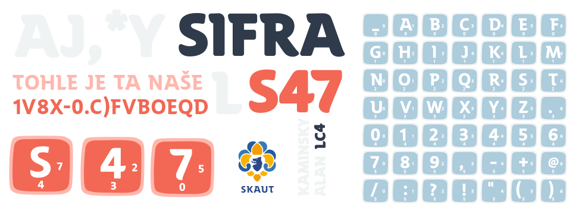

# Symetrická šifra LC4-6/7 ElsieFour - cipher
LS47 je šifra v podobě kostiček, která obstojí vůči výkonným počítačům a umožňuje jak šifrování, tak dešifrování ručně. Vychází z šifry ElsieFour (LC4), kterou popsal Alan Kaminsky. Tato šifra se vám může hodit, pokud nemáte k dispozici počítač nebo mu nedůvěřujete, ale potřebujete zabezpečit své soukromí na maximální úrovni.

Verze LS47 přináší několik vylepšení, můžete měnit počet znaků, 6x6 = 36, 7x7 = 42. Díky tomu je možné šifrovat různé strukturované informace, nebo udělat ruční dešifrování snažším - méně kartiček.




ElsieFour "A Low-Tech Authenticated Encryption Algorithm For Human-to-Human Communication",

### Prolomení šifry 
Symetrická šifra s klíčem o délce 138 bitů nabízí ohromnou odolnost proti útokům. Pokud by se někdo pokusil prolomit takovou šifru metodou brute-force, musel by vyzkoušet 2^138 různých kombinací –

Nyní představme si, že máme k dispozici superpočítač, který by byl schopný prověřit trilion (10^18) klíčů LS47 za sekundu. Dokonce i s touto neuvěřitelnou rychlostí by trvalo prolomení šifry přibližně miliardu let.


### Znaková tabulka
Hvězdička (násobení) * v novější verzi nahrazena @
Podtržítko _ ve scriptu ls47.py lze zaměnit za mezeru.

```
_ a b c d e f
g h i j k l m
n o p q r s t
u v w x y z .
0 1 2 3 4 5 6
7 8 9 , - + *
/ : ? ! ' ( )
```

Kostičky při přiblížení vypadají takto, je na nich napsaná původní poloha tzv. offset, která se bude využívat k šifrování a dešifrování.

```
/-----\  /-----\  /-----\  /-----\  /-----\
|     |  |     |  |     |  |     |  |     |
| _  0|  | a  1|  | b  2|  | c  3|  | d  4|  ...
|   0 |  |   0 |  |   0 |  |   0 |  |   0 |
\-----/  \-----/  \-----/  \-----/  \-----/

/-----\  /-----\
|     |  |     |
| g  0|  | h  1|  ...
|   1 |  |   1 |
\-----/  \-----/
   .        .
   .        .
   .        .
```

K ručnímu šifrování je zapotřebí ještě takzvaný "Marker" značka, může to být libovolný předmět, kamínek či kroužek. 

### Jak na to

Kostičky si rozložíme před sebe do čtverce, jejich permutace je tajný klíč k zašifrování a dešifrování. Tudíš kostičky můžete libovolně zamíchat, ale znalost rozložení kostiček je klíčové k dešifrování zprávy, proto si permutaci poznamenejte. Další možností je využít expanzní klíč, to je algoritmus, který funguje na bázi hesla, aby jste si nemuseli pamatovat rozložení kostiček, o tom si povíme až na konci.  

Vstupní písmena: Yes
První vstupní písmeno je "Y"


### 4 kroky k zašifrování písmene
1. Vstupní písmeno + offset [značky] = šifrované písmeno
2. Řádek se vstupním písmenem rotujeme o 1 doprava
3. Sloupec se zašifrovaným písmenem o 1 dolů
4. [Značku] posuneme o offset z kostičky se zašifrovaným písmenem

!!! Marker při posunu s kostičkama neposouváme.

# Pro vysvětlení si ukážeme příklad šifrování za pomocí obrázků:

Takto vypadá náš tajný klíč, podle kterého zašifrujeme a dešifrujeme zprávu. Ten si poznačte. Značku Marker [] položíme při začátku šifrování či dešifrování doleva nahoru.

```
  [e]f _ a b c d                                             
   l m g h i j k                                           
   ( ) / : ? ! '                                            
   s t n o p q r                                            
   z . u v w x y                                            
   5 6 0 1 2 3 4
   + * 7 8 9 , -
``` 


#### Najděte pozici vstupního písmena
Chceme-li zašifrovat písmeno: `Y`, najděte takzvané `vstupní písmeno` či `vstupní pozici` = písmeno Y


```

   [e]f _ a b c d                                             
   l m g h i j k                                           
   ( ) / : ? ! '                                            
   s t n o p q r                                            
   z . u v w x (y)                                            
   5 6 0 1 2 3 4
   + * 7 8 9 , -
   
```      


        
#### Značka (Marker)  []
Podívejte se nyní na kostičku se značkou (Marker) `[ ]`
Kostička označená značkou Marker s písmenem `E` má na sobě `offset` to je původní poloha kostičky `(5,0)` 

```
 /---------\
 |         |
 |    e  5 |
 |         |
 |    0    |
 \---------/
```

#### Vstupní písmeno
Nyní zašifrujeme písmeno Y
- Od jeho polohy nalezneme zašifrované písmeno.
- Od vstupního písmene počítejte cestu k zašifrovanému písmeni.
- Offset písmene E je (5,0), to znamená že od písmene Y se posuňme po kostičkách o 5 do prava.

Definice: Najděte `pozici vstupního písmene`, od toho písmene přičtěte `offset` z pozice kde se nachází značka (marker) = pozice zašifrovaného písmena


```

  [e]f _ a b c d                                             
   l m g h i j k                                           
   ( ) / : ? ! '                                            
   s t n o p q r                                            
   z . u v w x y    Y 1. 2. 3. 4. 5. -> W                                     
   5 6 0 1 2 3 4
   + * 7 8 9 , -
   
   Zašifrované písmeno je 'w'     (='y' pohyb (5 v pravo, 0 dolů)       Vyšlo 'w'!  
```       

### Rotace
2.`Řádek` se vstupním písmenem `rotujeme o 1 doprava`


```
Rotujte o jednu pozici celý řádek a sloupec

e]f _ a b c d        [e]f _ a b c d
l m g h i j k         l m g h i j k
( ) / : ? ! '         ( ) / : ? ! '
s t n o p q r         s t n o p q r
z . u v w x y  >>   y z . u v w x              Y se orotovalo do prava o jednu pozici
5 6 0 1 2 3 4         5 6 0 1 2 3 4
+ * 7 8 9 , -         + * 7 8 9 , -
```

3.`Sloupec` se `šifrovaným písmenem` rotuje o 1 dolů

```
Zde je hotová rotace o jedna dolů u sloupce kde se nacházelo W - zašifrované písmeno.

   [e]f _ a b , d                      
    l m g h i c k                   
    ( ) / : ? j '           
    s t n o p ! r                         
    y z . u v q x                     
    5 6 0 1 2 w 4
    + * 7 8 9 3 -
```
### 4. Značka
```

 /-----\
 |     |          Značku (Marker) posuneme o offset na kostičce se zašifrovaným písmenem
 | w  2|          Nyní se podívejte na zašifrovanou kostičku - W a značku posnuňte o offset (2,3)
 |   3 |          Značku posouváte od značky. Ke značce připočítejte offset zašifrovaného písmene.
 \-----/

```
Aktualizujte polohu značky (markeru) na pozici podle offsetu na zašifrovaném písmeni to je nyní `W = (2,3).`

```
     Marker je nyní na jiné pozici, a tudíš má i jiný offset.
    e f _ a b , d
    l m g h i c k
    ( ) / : ? j '
    s t[n]o p ! r
    y z . u v q x
    5 6 0 1 2 w 4
    + * 7 8 9 3 -
```
`HOTOVO` Máte zašifrované písmeno `Y`  `Výstup:W` Chcemeli zašifrovat slovo `YES`, opakujete proces od začátku, vstupní písmeno bude nyní `E` 


### Dešifrování
Proces dešifrování je podobný, především offset se `odečítá`. 
1. Od pozice vstupního písmene odečti offset z pozice značky = pozice dešifrovaného písmena
2. Řádek s rozluštěným písmenem rotujeme o 1 doprava
3. Sloupec se vstupním písmenem o 1 dolů
4. Značku (Marker) posuneme o offset na kostičce se nerozluštěným písmenem


### Expanzní klíč - heslo
Kostičky si rozložíme před sebe do čtverce, jejich permutace je tajný klíč k zašifrování a dešifrování. Můžete využít algoritmus, který funguje na bázi hesla, aby jste si nemuseli pamatovat rozložení kostiček.  

Heslo šifry = nástroj na vytvoření klíče
Podle pozice (offsetu) na vstupním písmeni, posuň první řádek do prava a sloupec se vstupním písmenem dolů.


Heslo: `ahoj`
První vstupní písmeno = "A", jeho původní pozice (offset) = 1,0
- Podivám se na první písmeno A a zjistím z něj offset 
- Posunu první řádek a sloupec o offset na písmeni A (do prava a pak dolů)
- Podivám se na druhé písmeno H a zjistím z něj offset 
- Posunu druhý řádek a sloupec o offset na písmeni B
- Podivám se na třetí písmeno O a zjistím z něj offset 
- Posunu třetí řádek a sloupec o offset na písmeni O
Posouváte se ze šikma dolů...

Heslo by mělo mít alespoň `dvacet znaků` abychom dosáhli dostatečné entropie.


## References

[1] *Kaminsky, Alan. "ElsieFour: A Low-Tech Authenticated Encryption Algorithm For Human-to-Human Communication." IACR Cryptology ePrint Archive 2017 (2017): 339.*
